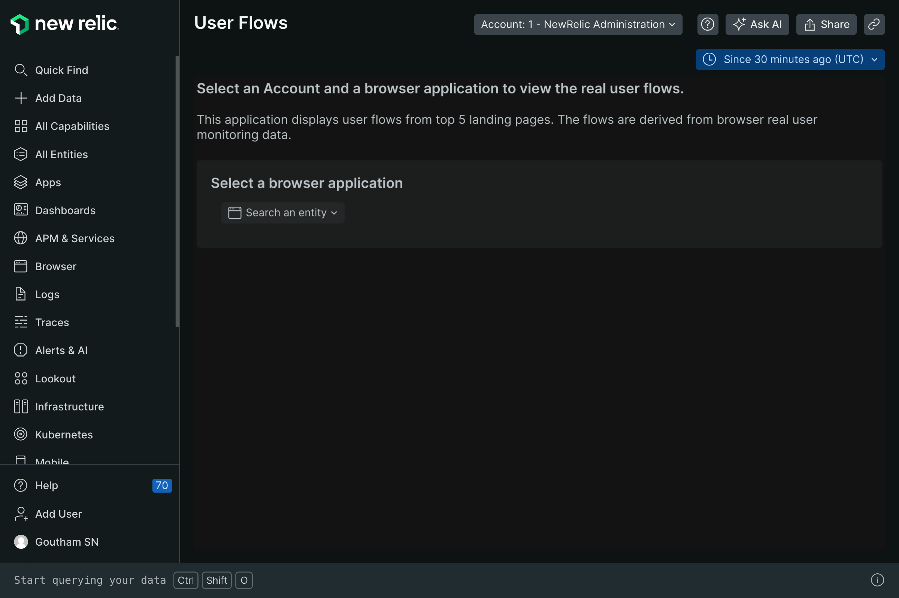
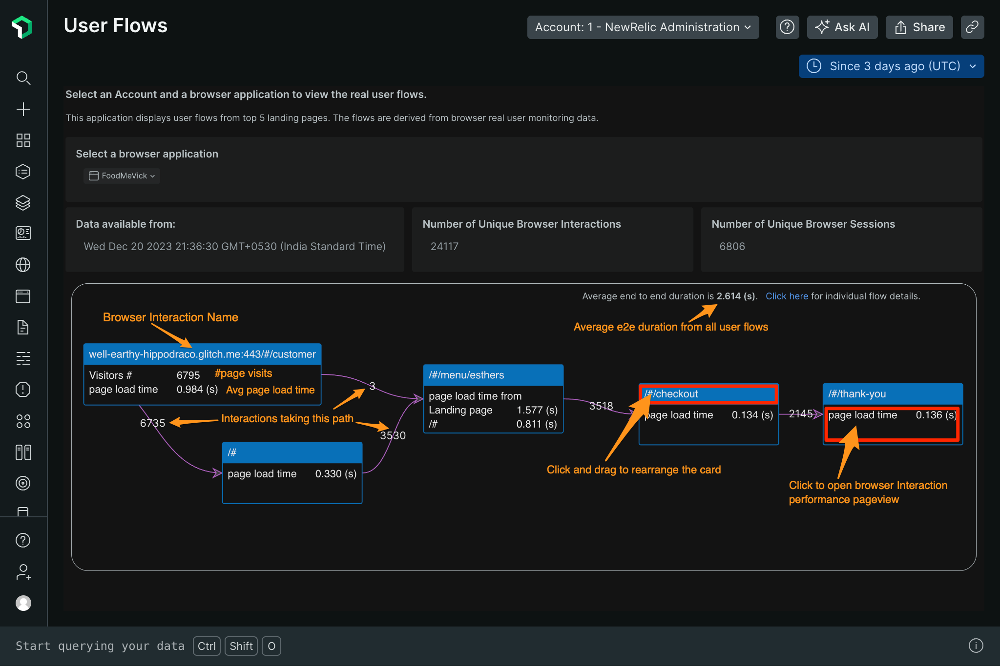
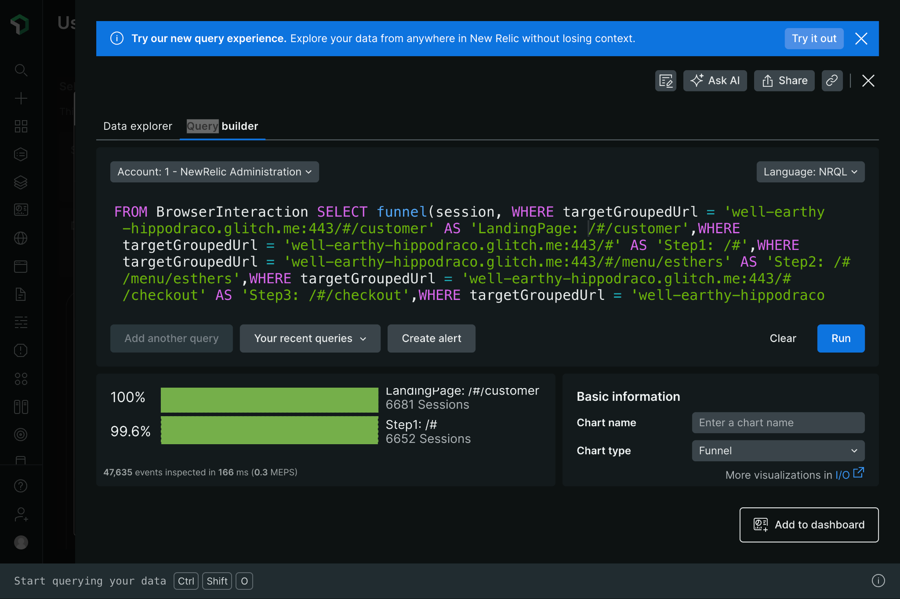

# User Flows (nr-user-flows)

  

This application is maintained by the New Relic Labs team. Connect with us directly by [creating issues](../../issues) or [starting a discussion](../../discussions) in this repo.

## Features

A user flow is a path an end user or customer navigates through a particular website, consisting of the actual web pages the user has traversed for various purposes.

Understanding the flows and experience of the user is highly important for meaningful interactions, business outcomes and revenue growth. A few benefits of analyzing user flows are as follows:
* Understanding your actual user personas: who your customers are; how they benefit from your products and services; what they are interested in.
* Enable product and engineering teams to spend their money and energy on the right set of features.
* Improve user adoption through the development of better user experiences and stickiness with your product.

Customers often spend a good amount of money and time in defining the most important user flows, which are often based on the understanding of the business segment, product knowledge and personas.

While there are products in the market that focus on providing this information, these often involve additional implementation steps, analytical capabilities, and adding too many tools for the team to manage. 

Also, these tools do not provide performance insights, which the DevOps teams can leverage and act upon where and why there has been an issue in a user flow.

New Relic’s User Flows is an app that brings the details of User flows and performance impacts in one screen, with a couple of clicks. 

* **One click Simple Set-up**
    * The User Flows are derived through analysis of existing browser interaction performance data captured by our browser agent.
    * No dependency on engineers to determine customer flows and their acceptable performance limits.
    * Savings in time and manpower.
* **Business Value**
    * Capture end user flows based on real user site interactions (via browser agent).
    * Create funnel conversion visualization of these flows’ with one click.
    * Identify end users drop off through each stage.
    * Capture the step by step performance of real users.
    * Better adoption of your product with increased user experience and loyalty.

## Usage

_See "Enabling this App" below for instructions on enabling the app in your account._

Upon opening the app, you will be asked to select a Browser entity to analyze. Note that the available list of entities is derived from the account selected in the platform account dropdown, and that the flow analysis will be generated for the period selected in the platform timepicker.

Once you have selected the correct account, entity and desired time period, the app will:
* display the top 5 landing pages of the users for this browser entity. 
* From each landing page, user flows are automatically derived and visualized as Flow diagrams.
* The app avoids cyclic paths at multiple levels.
* The app also provides additional information regarding unique Browser Interactions and Browser Sessions.

Each flow map provides below information
* Browser Interaction Names / Page views through which the users have navigated through your website.
* \# of page views on the landing page (This does not represent unique users, as user names are not captured by the browser agent).
* Provides the number of visitors (page views) across each path.
* On the top right corner of each flow map, the average end to end duration from all paths is calculated. For e.g., in the above image, there are 2 possible paths. The average displayed is the average of both the paths.
* The domain name is displayed only on the first landing page.
* Click on the title of the Browser Interaction card to rearrange each of the browser page view cards.
* Click on the body of the Browser Interaction card to view the performance page.

Click on the ***click here*** link to view all the individual journey details, a pop up window will appear, which displays all the Flows the end users have taken.

Each record provides the actual Flow path taken by a user.

Click on each Open Query Builder, which provides the NRQL to
1. E2E Duration Query - calculates the overall end to end flow duration. 
2. Stepwise Query - timeseries based line graph to quickly identify which step takes longer duration. This is very useful to quickly identify and troubleshoot the step, where there could be performance issues. 
3. Funnel Query - Funnel analysis (conversion rates) for each user flow. 

Within the Query Builder, you can create an alert or add this widget to a dashboard, which can help DevOps, SRE and Business owners.

Click on the body of the Browser Interaction card to view the browser interaction performance pageview to investigate any performance related issues, hindering the User Experience.

### Contributing and improving
We are open to all suggestions that will help to improve the analysis, suggestions, services and any other capability you can think off. Please raise an issue with as much detail as possible.

## Dependencies

Requires [`New Relic Browser`](https://newrelic.com/platform/browser-monitoring).

## Enabling this App

This App is available via the New Relic Catalog. 

To enable it in your account: 
1. go to `Add Data > Apps and Visualzations` and search for "User Flows"
2. Click the `User Flows` card, and then click the `Add this App` button to add it to your account(s)
3. Click `Open App` to launch the app (note: on the first time accessing the app, you may be prompted to enable it)

Once you have enabled the app, you can also open it by:
1. Open the `Apps` left-hand navigation menu item (you may need to click on the `Add More` ellipsis if it doesn't show up by default)
2. In the `Your Apps` section, locate and click on the `User Flows` card to open the app 

Read our [documentation](https://developer.newrelic.com/build-apps/permission-manage-apps/) to learn about Nerdpack permissions, if you have trouble accessing the app.

#### Manual Deployment
If you need to customize the app, fork the codebase and follow the instructions on how to [Customize a Nerdpack](https://developer.newrelic.com/build-apps/customize-nerdpack). If you have a change you feel everyone can benefit from, please submit a PR!

## Support

This project is actively maintained by the New Relic Labs team. Connect with us directly by [creating issues](../../issues) or [asking questions in the discussions section](../../discussions) of this repo.

We also encourage you to bring your experiences and questions to the [Explorers Hub](https://discuss.newrelic.com) where our community members collaborate on solutions and new ideas.

New Relic has open-sourced this project, which is provided AS-IS WITHOUT WARRANTY OR DEDICATED SUPPORT.

## Security

As noted in our [security policy](https://github.com/newrelic/nr1-github/security/policy), New Relic is committed to the privacy and security of our customers and their data. We believe that providing coordinated disclosure by security researchers and engaging with the security community are important means to achieve our security goals.

If you believe you have found a security vulnerability in this project or any of New Relic's products or websites, we welcome and greatly appreciate you reporting it to New Relic through [HackerOne](https://hackerone.com/newrelic).

## Contributing

Contributions are welcome (and if you submit a Enhancement Request, expect to be invited to contribute it yourself :grin:). Please review our [Contributors Guide](CONTRIBUTING.md).

Keep in mind that when you submit your pull request, you'll need to sign the CLA via the click-through using CLA-Assistant. If you'd like to execute our corporate CLA, or if you have any questions, please drop us an email at opensource+nr1-github@newrelic.com.

## Open Source License

This project is distributed under the [Apache 2 license](LICENSE).
