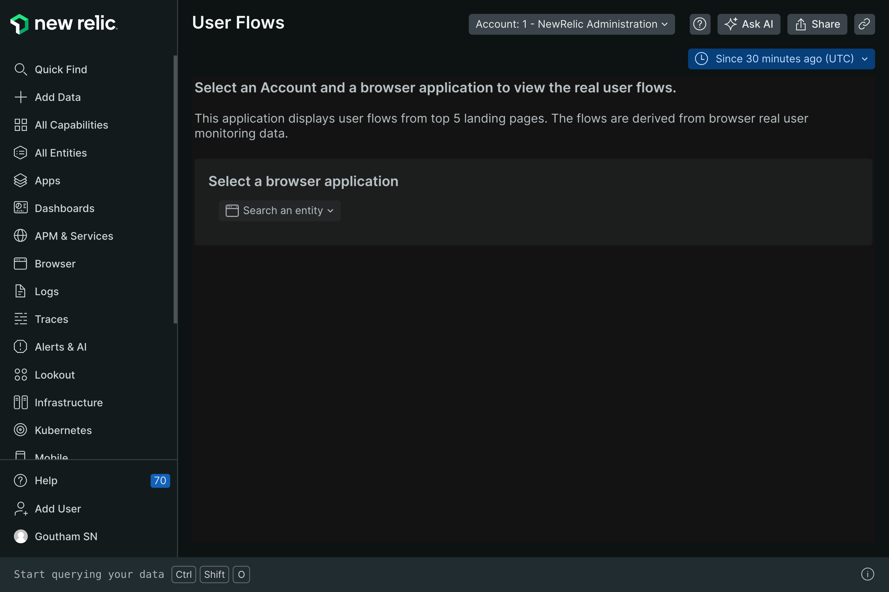
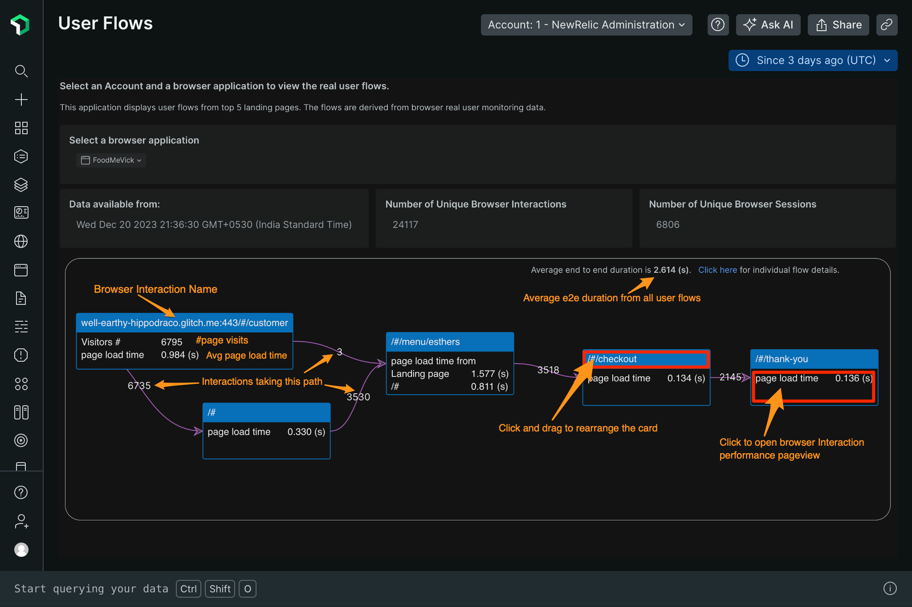
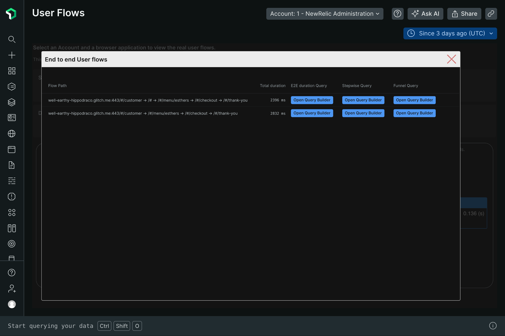
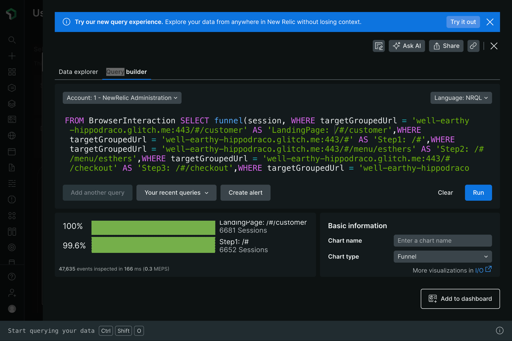
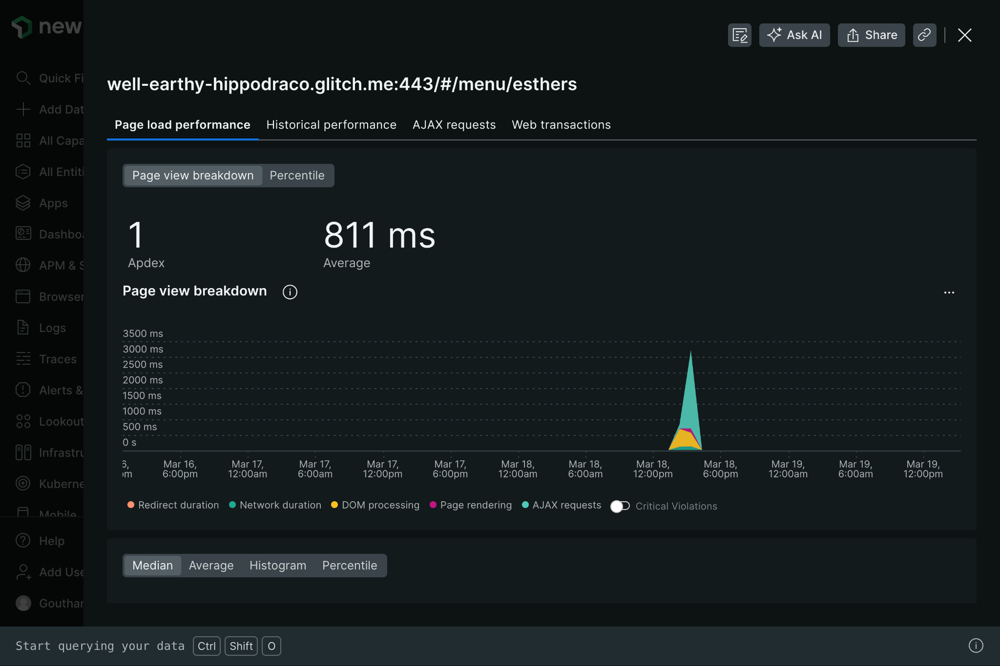

## New Relic User Flows App

A user flow is a path an end user or customer navigates through a particular website, to perform an intended action or finish his task using our features or products. This flow consists of the actual web pages the user has traversed through for various purposes.

Understanding the flows and experience of the user is highly important for meaningful interactions, business outcomes and revenue growth. A few benefits of analyzing user flows are as follows:
* Understanding your actual user personas
    * With the help of every action and page the end user visits on your website, it helps you to understand who your customers are, how they benefit from your products and services and also what they want.
    * This enables product and engineering teams to spend their money and energy on the right set of features.
* Improve user adoption
    * For any enterprise product, user adoption and experience is of utmost importance as it implies better user experience and stickiness with your product.

Customers often spend a good amount of money and time in defining the most important user flows, which are often based on the understanding of the business segment, product knowledge and personas.

While there are products in the market that focus on providing this information, these often involve additional implementation steps, analytical capabilities, and adding too many tools for the team to manage. 

Also, these tools do not provide performance insights, which the DevOps teams can leverage and act upon where and why there has been an issue in a user flow.

New Relic’s User Flows is an app that brings the details of User flows and performance impacts in one screen, with a couple of clicks. 

* **One click Simple Set-up**
    * The User Flows are derived by culminating existing browser interaction performance data captured by our browser agent.
    * No dependency on engineers to determine customer flows and their acceptable performance limits.
    * Savings in time and manpower.
* **Business Value**
    * Capture end user flows’ based on real user site interactions (via browser agent).
    * Provides funnel conversion of these flows’ with one click.
    * Shows how end users drop off through each stage.
    * Capture the step by step performance of real users.
    * Better adoption of your product with increased user experience and loyalty.

## User Guide

New Relic’s User Flows nerd pack / custom app can be accessed from our unified catalog of integrations, dashboards, alerts, Nerdpacks, and more. 

Read our [documentation](https://developer.newrelic.com/build-apps/permission-manage-apps/) to learn about Nerdpack permissions, if you have trouble accessing the app.

In [New Relic UI](https://one.newrelic.com/), 
1. click on Apps on the Left navigation (first column)
2. Search for ***User Flows*** app
3. Click on the app tile. 

The app would the home page of the application, which consists of three drop menus.
1. **Account** drop down menu  - This displays all the accounts you have access to, as a user.
2. **Entity list** drop down menu - This displays all the browser entities monitored in the account selected.
3. **Time range** drop down menu - The time duration for which the user flows needs to be displayed.

Select an account, a browser entity and a time range.

The app would then 
* display the top 5 landing pages of the users for this browser entity. 
* From each landing page, user flows are automatically derived and visualized as Flow diagrams.
* The app avoids cyclic paths at multiple levels.
* The app also provides additional information regarding unique Browser Interactions and Browser Sessions.

Each flow map provides below information
* Browser Interaction Names / Page views through which the users have navigated through your website.
* \# of page views on the landing page (This does not represent unique users, as user names are not captured by the browser agent).
* Provides the number of visitors (page views) across each path.
* On the top right corner of each flow map, the average end to end duration from all paths is calculated. For e.g., in the above image, there are 2 possible paths. The average displayed is the average of both the paths.
* The domain name is displayed only on the first landing page.
* Click on the title of the Browser Interaction card to rearrange each of the browser page view cards.
* Click on the body of the Browser Interaction card to view the performance page.

Click on the ***click here*** link to view all the individual journey details, a pop up window will appear, which displays all the Flows the end users have taken.

Each record provides the actual Flow path taken by a user.

Click on each Open Query Builder, which provides the NRQL to
1. E2E Duration Query - calculates the overall end to end flow duration. 
2. Stepwise Query - timeseries based line graph to quickly identify which step takes longer duration. This is very useful to quickly identify and troubleshoot the step, where there could be performance issues. 
3. Funnel Query - Funnel analysis (conversion rates) for each user flow. 

You can create an alert or add this widget to a dashboard, which can help DevOps, SRE and Business owners.

Click on the body of the Browser Interaction card to view the browser interaction performance pageview to investigate any performance related issues, hindering the User Experience.

